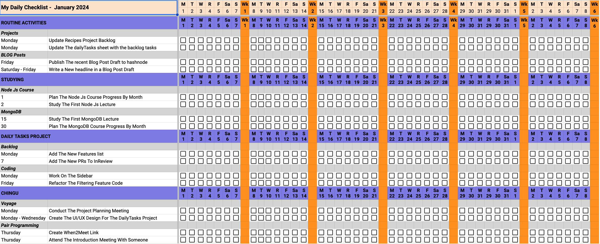

# voyage-project-tier3-dailytasks
Voyage Project - Tier 3 - Daily tasks productivity tool

## Table of Contents

* [Overview](#overview)
* [General Instructions](#general-instructions)
* [Requirements & Specifications](#requirements-specifications)
* [Acknowledgements](#acknowledgements)
* [About Chingu](#about-chingu)

## Overview

A daily task productivity tool is a system designed to help individuals organize and manage their tasks effectively on a day-to-day basis. 

It typically includes features such as task creation, scheduling, prioritization, and tracking. Users can input tasks, assign deadlines, set priorities, categorize tasks based on projects or urgency, and monitor progress.

These tools often come with user-friendly interfaces, allowing users to easily navigate, add, edit, and delete tasks. They may include features like reminders, notifications, and integrations with calendars or emails to keep users informed about upcoming tasks or deadlines.

Overall, a daily task productivity tool aims to streamline task management, enhance organization, and improve efficiency in completing daily tasks and achieving goals.

Your Chingu Voyage team is harnessing this dataset to craft a web application dedicated to assisting individuals in efficiently organizing their daily tasks. The application will encapsulate various features enabling users to explore and schedule their tasks effectively. Through a concise summary, users will be empowered to select specific segments for a more detailed, step-by-step breakdown.

This project will offer a valuable opportunity for you to gain hands-on experience in web development while handling multi-dimensional datasets. It's an ideal chance to hone your skills by working on a practical application, allowing you to delve into the complexities of data manipulation within a web-based environment.

## General Instructions

This project is designed to be worked on by a team rather than an individual
Chingu. This means you and your team will need to thoroughly read and
understand the requirements and specifications below, **_and_** define and
manage your project following the _Agile Methodology_ defined in the
[Voyage Handbook](https://chingucohorts.notion.site/Voyage-Guide-1e528dcbf1d241c9a93b4627f6f1c809).

As you create this project make sure it meets all of the requirements, but once
it reaches MVP, start implementing the optional features or get creative and
extend it in ways we haven't envisioned. In other words, use the power of
teamwork to make it distinctive and unique.

Take note that we haven't given specific direction on what your UI/UX should
look like. This is another area where you and your team can put your creativity 
to work! 

## Requirements & Specifications

### What You Need to Do

The following define the minimum requirements and ideas for features you may
implement to enhance this app, if time permits.

#### Structure

- [ ] Develop backend/API endpoints to handle user authentication, task creation, assignment, updates, and task completion actions.
- [ ] Utilize authentication mechanisms (e.g., JWT, OAuth) to authenticate users and manage user sessions securely. 
- [ ] Choose an appropriate Database Management System (DBMS) to support relational or non-relational data storage based on the application's requirements.
- [ ] Create a user-friendly interface (frontend) that allows users to view, create, update, and complete tasks collaboratively.
- [ ] You may use any languages, tools, or libraries you prefer when designing and building this app. 
- [ ] We've included a JSON file containing the raw data in the `/assets` directory in this repo. 
- [ ] The system should parse the provided JSON file to categorize and structure tasks according to categories, activity types, and individual tasks.
    - Category of Work Array:
        - The system must process the JSON data to identify different categories of work, each represented as an array.
        - Activity Type Array:
            - Within each category, the system should categorize tasks further into activity types, forming an array of these types.
            - Task Array:
                - Tasks within each activity type should be listed in an array, including:
                - Task Name: The name/title of the task.
                - Task Detailed Description: A comprehensive description or details about the task.
                - Due Date:
                    - For monthly tasks: The day number of the month the task is due on.
                    - For weekly tasks: Allowance for the day name (e.g., 'Sunday') or the day number.
                    - Flexibility to accept multiple day numbers or day names for a task.
- [ ] Automatically generate a daily checklist for tasks based on a matrix of categories and tasks listed against days of the month.
- [ ] You may **_NOT_** use AI-base solution generators like GitHub CoPilot.
- [ ] Useful links and resources:
    - [Learn about LocalStorage in JavaScript](https://jagathishsaravanan.medium.com/learn-about-localstorage-in-javascript-228b3290275)

#### Styling

- [ ] Surprise us!!! Use your teams creativity to make this app distinctive.
- [ ] Add a footer containing a link to your teams GitHub repo
- [ ] In general, you will find these [UI design principles](https://www.justinmind.com/ui-design/principles) helpful.
- [ ] Recommend using this resource for [clean CSS](https://www.devbridge.com/articles/implementing-clean-css-bem-method/)

#### Functionality

- Initial Checklist Generation:
    - [ ] You may use the provided JSON data for your initial database load and initial testing.
    - [ ] Display checkboxes at the intersections of categories/tasks and days.
    - [ ] Generate the matrix only for the current month.
    - [ ] Determine the current month dynamically based on the system's date.
- Categories & Tasks
    - [ ] Display all available categories and their associated tasks on the left side of the matrix.
    - [ ] Populate the matrix with tasks listed under their respective categories.
- Days of the Month
    - [ ] Populate the top row of the matrix with the days of the current month.
    - [ ] Ensure correct alignment of dates based on the current month's calendar.
- Checkbox Intersections
    - [ ] Display checkboxes at the intersections of each task/category and the corresponding day of the month.
    - [ ] Populate checkboxes only for the specific date(s) tasks are to be completed, as mentioned in the JSON data.
    - [ ] Reflect completion status by dynamically checking/unchecking these checkboxes based on the completion status data.
- Additional Notes:
    - [ ] Upon completing a task (checking the corresponding checkbox), enable a feature to input additional notes related to that specific task.
    - [ ] Direct users to a dedicated page or modal window where they can type, edit, and save notes related to the completed task.
    - [ ] Implement a user-friendly text input field or area, enabling users to add comprehensive details or comments.
    - [ ] Include a "Save" or "Submit" button to store these notes and associate them with the completed taskfor future reference or review.
- Maintain History in Database
    - [ ] Create a structured database schema to store historical task data, including task details, completion status, timestamps, and user associations.
    - [ ] Implement CRUD (Create, Read, Update, Delete) operations for managing task records in the database, ensuring data persistence and integrity.
    - [ ] Store the generated checklist in the database to persist user data beyond the initial session.
    - [ ] Update the checklist in the database whenever changes are made.
    - [ ] Introduce a "Save" button specifically for updating the database.
    - [ ] On clicking "Save," capture the current state of the task list, including modifications and progress.
    - [ ] Store this updated data in the database to maintain the latest user changes.
    - [ ] Implement a 'Reset' button functionality that allows users to refresh the current view by loading the last saved copy from the database
- Collaboration Among Multiple Users
    - [ ] Implement user authentication and authorization mechanisms to allow multiple users to access and collaborate on tasks securely.
    - [ ] Design features that enable users to create, assign, view, and update tasks collaboratively.
- Record User-Specific Task Completions
    - [ ] Establish relationships between users and tasks within the database schema to record which user completed which task.
    - [ ] Provide functionality for users to mark tasks as completed, associating the completion action with the respective user ID and timestamp.
    - [ ] Facilitate retrieval of task history records with user-specific completion details for reporting or analysis.  
- Dynamic Data Handling
    - [ ] Fetch and display only relevant tasks and days for the current month.
    - [ ] Handle cases where tasks may have different due dates within the month.
    - [ ] If the user clicks on a task that has been completed, remove the check mark. In other words, clicking toggles the
    checkmark
    - [ ] Click on task name to show additional detailed description in a popup

### Extras (Not Required)

- [ ] Add a filter to allow the user to list tasks scheduled for a particular day or week. Alternatively, allow the filter to scroll and/or highlight tasks that match the filter criteria
- [ ] Implement mechanisms (such as WebSocket connections or server polling) to provide real-time updates for task changes made by different users.
- [ ] Incorporate logging mechanisms to track modifications, additions, or deletions of task data for auditing and accountability purposes.
- [ ] Provide visual cues such as color changes or labels to indicate completed tasks for improved user experience.

### Aceptance Criteria

- [ ] The checklist initially loads data from the provided JSON structure.
- [ ] After the initial load, all checklist modifications and updates are stored in the database.
- [ ] Checkboxes are populated only for the specific date(s) indicated in the JSON data for each task's completion.
- [ ] Users experience uninterrupted functionality during and after the transition.
- [ ] Tasks marked as completed persist in the database.
- [ ] Clicking the "Save" button successfully updates the database with the latest task list state and progress.
- [ ] The "Save" and "Reset" button is positioned intuitively and visibly for easy access.
- [ ] Different team members can access and work on tasks securely.
- [ ] Task completion records show who marked a task as complete.
- [ ] User authentication and authorization mechanisms are implemented securely, allowing multiple users to access and collaborate on tasks.

## About Chingu

If you aren’t yet a member of Chingu we invite you to join us. We help our 
members transform what they’ve learned in courses & tutorials into the 
practical experience employers need and want.